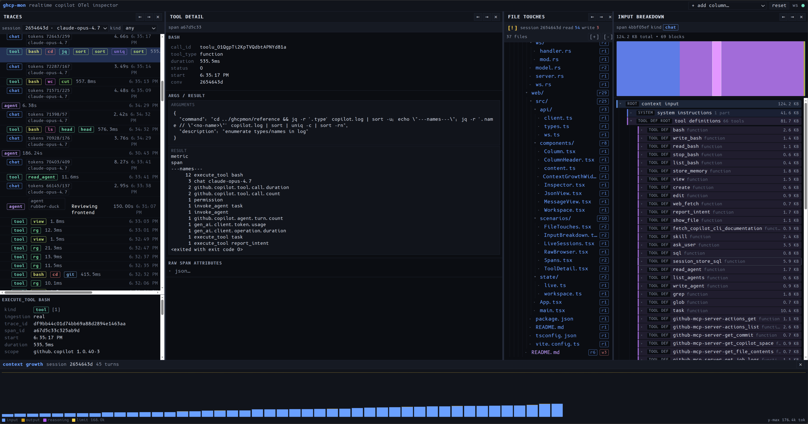

# ghcp-mon

Local-first telemetry collector + realtime dashboard for the GitHub Copilot CLI's OpenTelemetry export.



## Usage

### Running

Launch Copilot CLI with the OTLP exporter pointed at ghcp-mon:

```bash
OTEL_EXPORTER_OTLP_ENDPOINT=http://127.0.0.1:4318 \
OTEL_INSTRUMENTATION_GENAI_CAPTURE_MESSAGE_CONTENT=true \
OTEL_SEMCONV_STABILITY_OPT_IN=gen_ai_latest_experimental \
copilot
```

Then run `./ghcp-mon serve` and click the API+WS link to open the dashboard:

```
$ ./ghcp-mon serve
 INFO OTLP listening on http://127.0.0.1:4318
 INFO API+WS listening on http://127.0.0.1:4319
```

### Listeners

| Listener  | Default          | Purpose                                                              |
|-----------|------------------|----------------------------------------------------------------------|
| OTLP      | `127.0.0.1:4318` | OTLP/HTTP receiver: `POST /v1/{traces,metrics,logs}` (JSON only — protobuf returns 501) |
| API + WS  | `127.0.0.1:4319` | Dashboard REST + WebSocket fanout (`/api/...`, `/ws/events`)         |
| Vite dev  | `127.0.0.1:5173` | Frontend dev server                                                  |

Override with `--otlp-addr` / `--api-addr` on `ghcp-mon serve`. The global `--session-state-dir <PATH>` flag overrides the default location (`$COPILOT_SESSION_STATE_DIR` env var, then `$HOME/.copilot/session-state`) used to read per-conversation `workspace.yaml` sidecar metadata.

## Dev Setup

### Backend

```bash
cargo build
cargo run -- serve                       # boots both listeners
cargo run -- serve --db /tmp/ghcp.db     # custom DB path
```

The DB defaults to `./data/ghcp-mon.db` (WAL mode, foreign keys on, single migration `0001_init.sql`).

### Frontend

```bash
cd web
npm install
npm run dev                              # vite at :5173
```

Open <http://127.0.0.1:5173>. The default workspace seeds four columns: Sessions | Traces | Tool detail | Input breakdown. Use the column header buttons to add, remove, reorder, or change scenario type.

### Layout

- **Backend** (`./`): Rust + axum + sqlx (SQLite WAL). OTLP/HTTP receiver, normalization pipeline, REST API, WebSocket fanout.
- **Frontend** (`./web/`): React + TypeScript + Vite. Multi-column dashboard with 6 scenario types (live sessions, spans, tool detail inspector, input breakdown, file touches, raw record browser).

See `./plan.md` for the project plan, `./supplemental.md` for the supplemental requirements, and `./docs/api.md` for the full HTTP API contract.

## References

- [OpenTelemetry Semantic Conventions — Gen AI Spans](https://opentelemetry.io/docs/specs/semconv/gen-ai/gen-ai-spans/)

## Demo Video

<video width="640" height="360" controls>
    <source src="https://github.com/map-blasterson/ghcp-mon/raw/refs/heads/main/doc/demo.mp4" type="video/mp4">
</video>